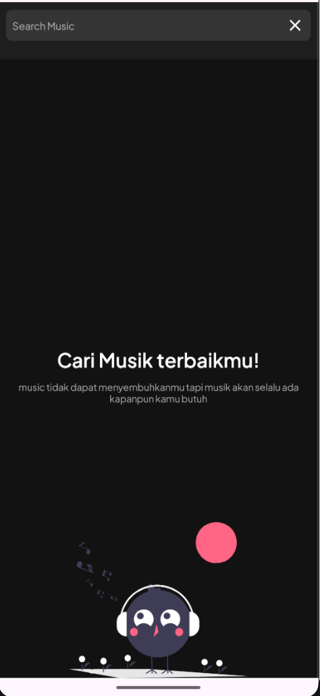
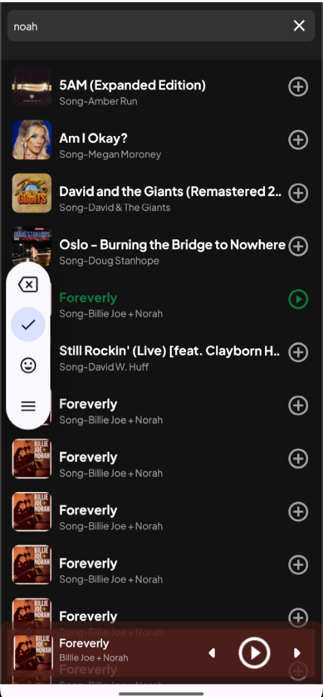
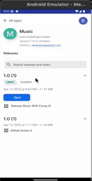
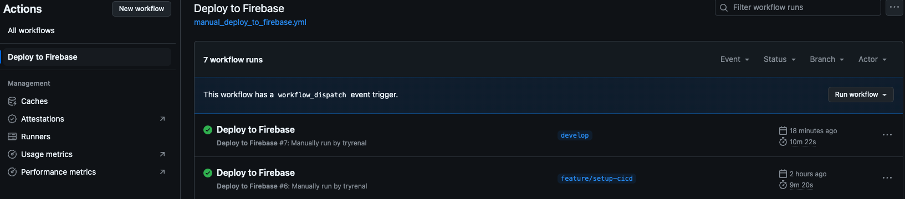
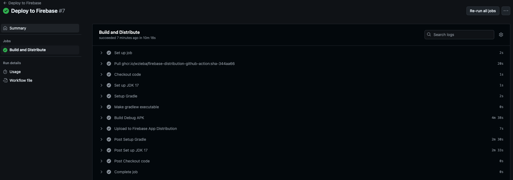

# Music App

Welcome to the Music App! This app allows users to search for music that will show their feelings.

## Features

- Search for an artist that will show a list of music.
- Play music.

## Technologies Used

- Retrofit: A type-safe HTTP client for making API calls.
- Coroutine: Kotlin's concurrency framework for managing asynchronous operations.
- Dagger Hilt: A dependency injection framework for managing dependencies.
- MVVM: Model-View-ViewModel architecture pattern for separating concerns.
- Clean Architecture: A design pattern that promotes separation of concerns and maintainability.
- Modularization: Separate concern for module
- Unit Testing: Writing unit tests for business logic using JUnit and Mockito.

## Getting Started

1. Clone the repository.
2. Open the project in Android Studio.
3. Build and run the app on your preferred device or emulator.

## API Integration

The app fetches music from the [MusicAPI](https://itunes.apple.com/) API.

## Architecture

The app follows the clean architecture pattern, structuring its components using modularization. This ensures a separation of concerns and facilitates testability and maintainability.

### Modules

The app is divided into different modules:

- **app**: The main Android application module.
- **data**: Data-related modules, including data sources and repositories.
- **domain**: Contains the business logic and app use cases.

## Unit Testing

The app includes unit tests for the use cases, ensuring that the business logic works as expected. These tests can be found in the respective test directories under the "domain" module.

## Music App
  

## CI Github Action

#### Social Media
| [LinkedIn](https://www.linkedin.com/in/renalsa18/) | [Youtube](https://www.youtube.com/channel/UCU9kq_235U9rEYT6v6DE_tQ?view_as=subscriber) | [Medium](https://renaldysabdo.medium.com)
